# Email Retention Policy

## Overview

This document describes the implementation of an email retention policy in Microsoft Purview.

## Prerequisites

- Compliance Administrator role
- Microsoft Purview access

---

## Step 1 - Access Microsoft Purview

Navigate to:

https://purview.microsoft.com/

Screenshot:
[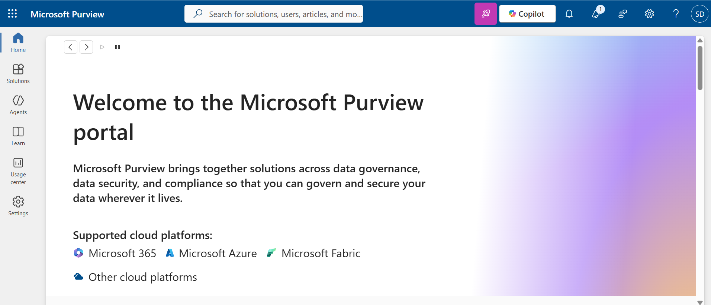](../screenshots/step01-access-purview.png)
---

## Step 2 - Open Retention Policies

Navigate to:

Data Lifecycle Management > Retention Policies

Screenshot:
[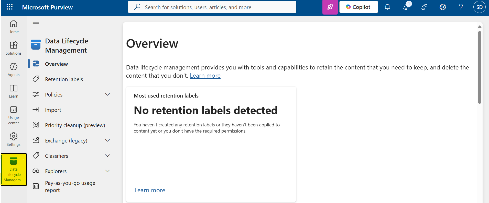](../screenshots/step02-retention-policies.png)
### Step 2.1 - Retention Policies Overview

Review the existing retention policies and select **New retention policy**.

Screenshot:
[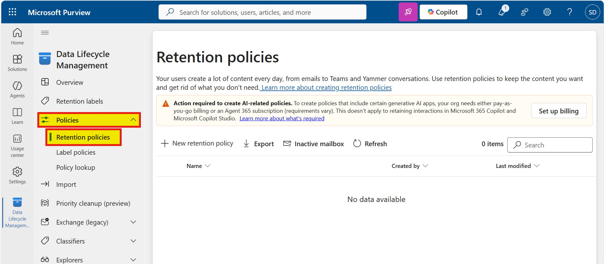](../screenshots/step02.1-retention-policies.png)
---

## Step 3 - Create a New Policy

Click **New retention policy** to start the configuration wizard.

Screenshot:
[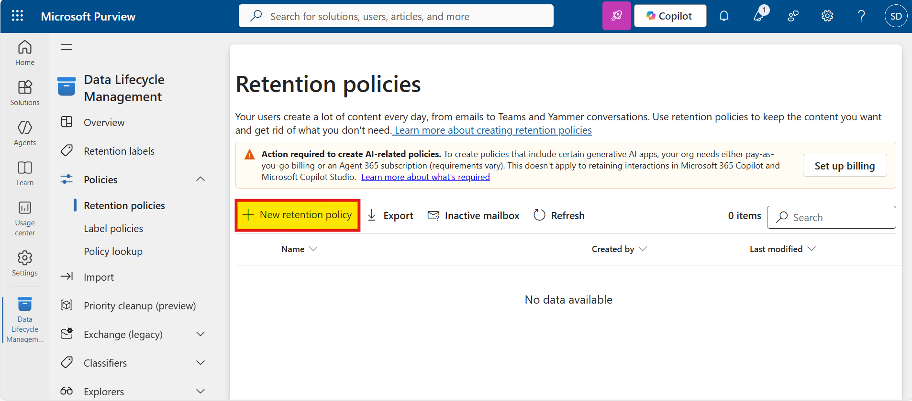](../screenshots/step03-create-policy.png)
---

## Step 4 - Configure Policy Details

Enter the following information:

- Policy Name
- Description

Provide a meaningful name and description that clearly identifies the purpose of the policy.

Screenshot:
[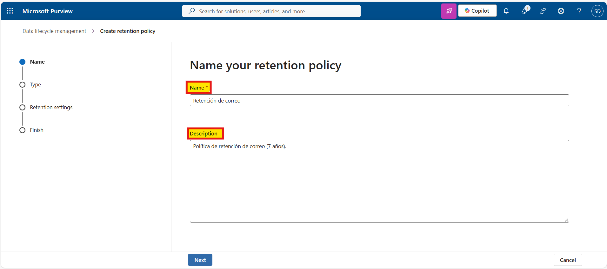](../screenshots/step04-policy-details.png)
---

## Step 5 - Select Policy Type

Choose the appropriate retention policy type according to the business requirements.

Screenshot:
[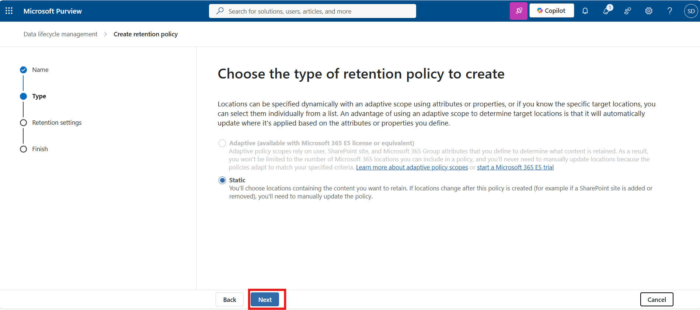](../screenshots/step05-policy-type.png)
---

## Step 6 - Select Policy Locations

Select the workloads where the retention policy will be applied.

Available locations include:

- Exchange mailboxes
- SharePoint sites
- OneDrive accounts
- Microsoft 365 Groups
- Microsoft Teams

For this implementation, the policy applies to Exchange Online mailboxes.

Screenshot:
[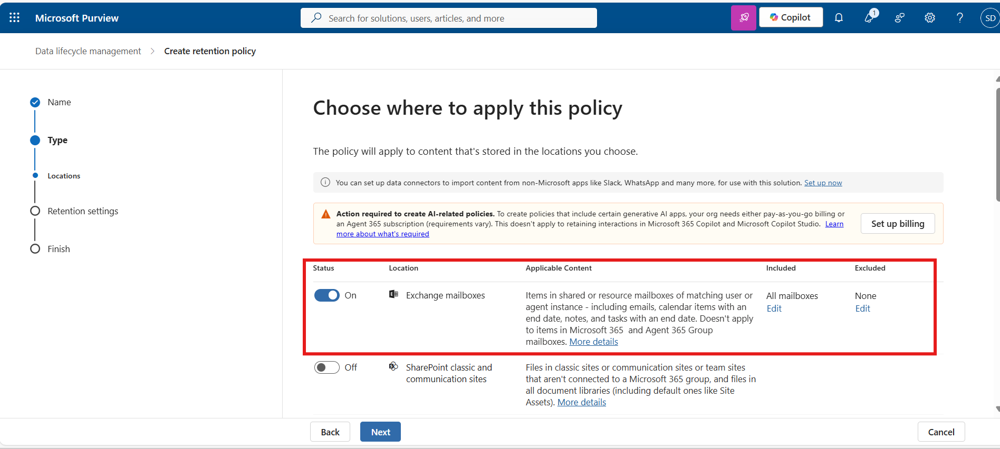](../screenshots/step06-policy-locations.png)
### Step 6.1 - Configure Mailbox Scope

Choose whether the policy should apply to:

- All mailboxes
- Specific mailboxes
- Excluded mailboxes

Screenshot:
[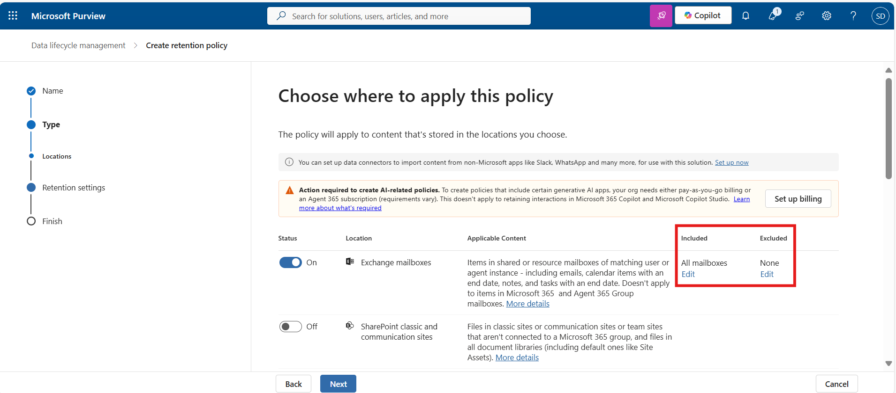](../screenshots/step06.01-mailbox-scope.png)
### Step 6.2 - Search Mailboxes to Exclude

Search for the mailboxes or groups that should be excluded from the policy.

Screenshot:
[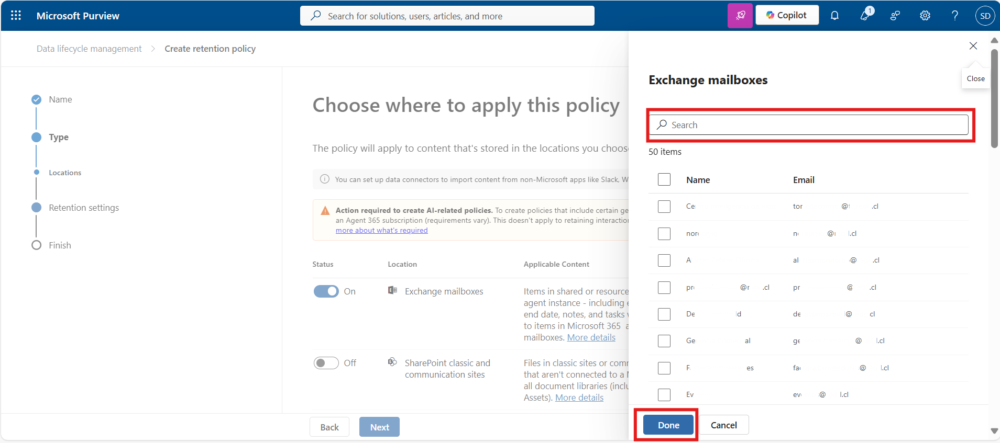](../screenshots/step06.02-search-excluded-mailboxes.png)
### Step 6.3 - Confirm Excluded Mailboxes

Verify the list of excluded mailboxes.

In this configuration, 10 mailboxes were excluded from the policy.

Screenshot:
[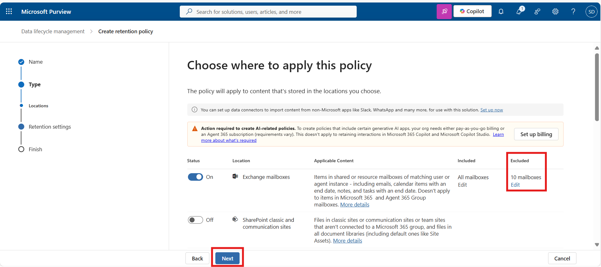](../screenshots/step06.03-excluded-mailboxes.png)
---

## Step 7 - Configure Retention Settings

Select what should happen to content when the retention period expires.

Available options include:

- Retain content
- Delete content
- Retain and then delete
- Archive (if applicable)

Configure the option that meets the organization's compliance requirements.

Screenshot:
[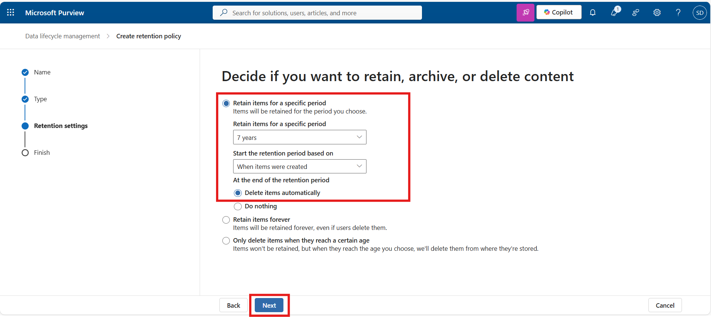](../screenshots/step07-retention-settings.png)
---

## Step 8 - Review and Submit

Review all configuration settings before publishing the retention policy.

Verify:

- Policy name
- Locations
- Included and excluded mailboxes
- Retention settings

Click **Submit**.

Screenshot:
[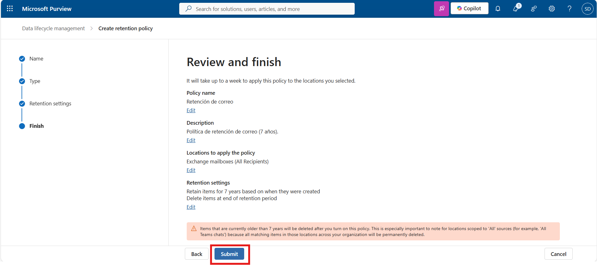](../screenshots/step08-review-submit.png)
---

## Step 9 - Policy Created Successfully

Verify that the policy was successfully created.

Screenshot:
[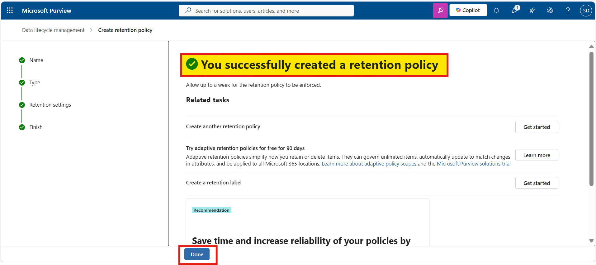](../screenshots/step09-policy-created.png)
---

## Step 10 - Verify Policy in Retention Policies List

Navigate back to **Retention Policies** and confirm that the new policy appears in the list.

Verify:

- Policy name
- Status
- Locations
- Last modified date

Screenshot:
[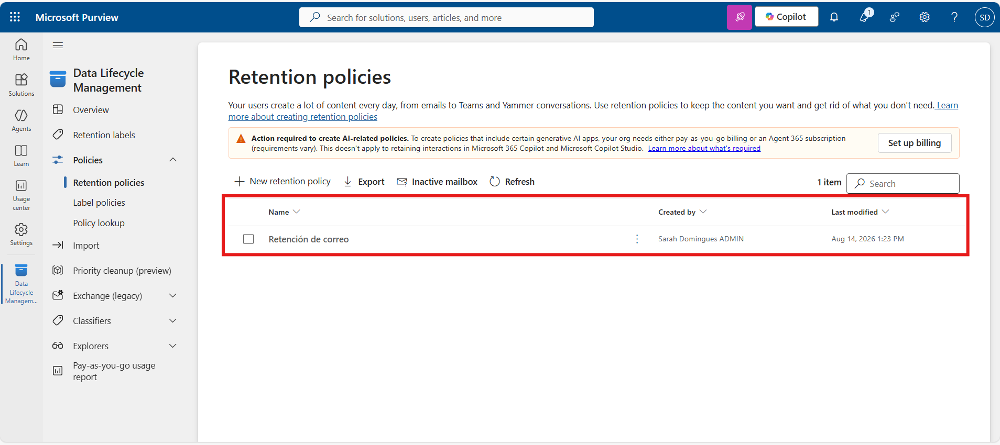](../screenshots/step10-policy-listed.png)

---

## Validation

Verify that:

- The policy status is **Active**
- Exchange Online is included in the scope
- Excluded mailboxes are correct
- The retention period matches the approved requirement
- The policy appears in the Retention Policies list

---

## Rollback

If the policy needs to be removed:

1. Open Microsoft Purview.
2. Navigate to **Retention Policies**.
3. Select the policy.
4. Disable the policy or delete it.
5. Confirm the change.

---

## Change Log

| Date | Author | Description |
|--------|--------|--------|
| 2026-08-14 | Sarah Domingues | Initial implementation and documentation |
